# 📱 Diabetic Plus

<p align="center">
  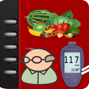
</p>

<p align="center">
  <strong>Track daily logs, blood sugar charts, activity records, meals, diabetes risk scores, and symptoms — 100% offline.</strong>
</p>

<p align="center">
  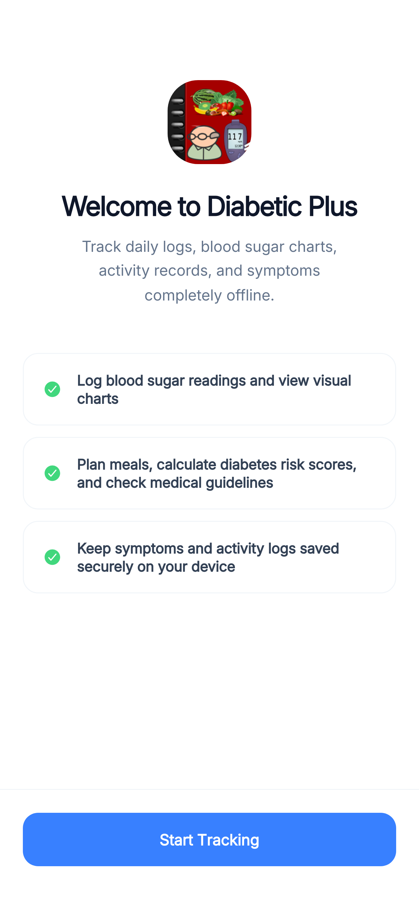
  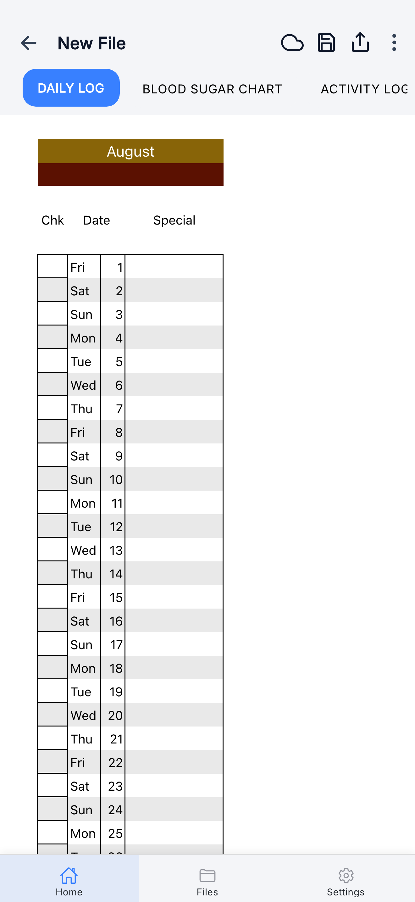
  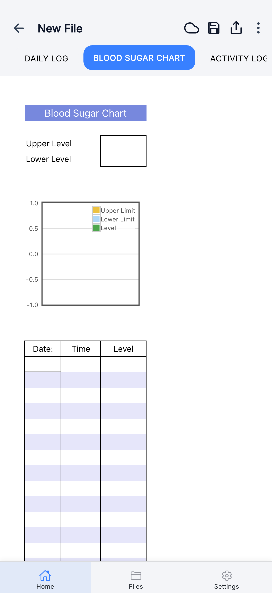
  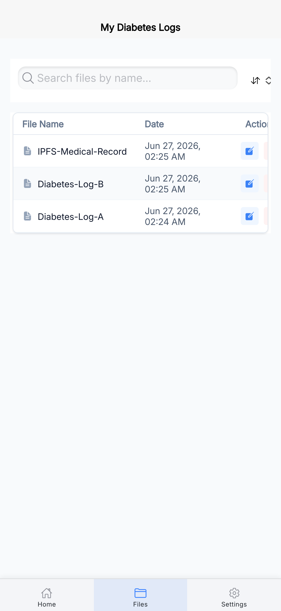
</p>

---

## 🩺 About the App

**Diabetic Plus** is a premium, offline-first hybrid mobile and web application built with the **Ionic Framework (React)** and **Capacitor**. It provides a comprehensive diabetes self-management toolkit powered by a mobile-optimized **SocialCalc** spreadsheet engine, with optional decentralized **IPFS** cloud backups.

All data stays on your device — no accounts, no cloud dependency, no data collection.

---

## ✨ Key Features

- **Daily Log** — Record daily check-ins, dates, and special notes for each day of the month.
- **Blood Sugar Chart** — Visualize glucose readings over time with a built-in chart view.
- **Activity Log** — Track physical activity and exercise sessions.
- **Meal Planner** — Plan and log meals to manage dietary intake.
- **Medical Guidelines** — Built-in reference sheet for diabetes care guidelines.
- **IPFS Cloud Backup** — Encrypt and push your logs to the IPFS network; restore via a Content Identifier (CID) from any device.
- **My Diabetes Logs (Files Page)** — View, search, sort, and open all saved log files (e.g., `Diabetes-Log-A`, `Diabetes-Log-B`, `IPFS-Medical-Record`).
- **Settings** — Manage app preferences, data storage, and integrations.
- **100% Offline-First** — All data stored locally using `localStorage`; no network required.

---

## 📸 Screenshots

| Welcome | Daily Log | Blood Sugar Chart | Activity Log |
|:---:|:---:|:---:|:---:|
|  |  |  | 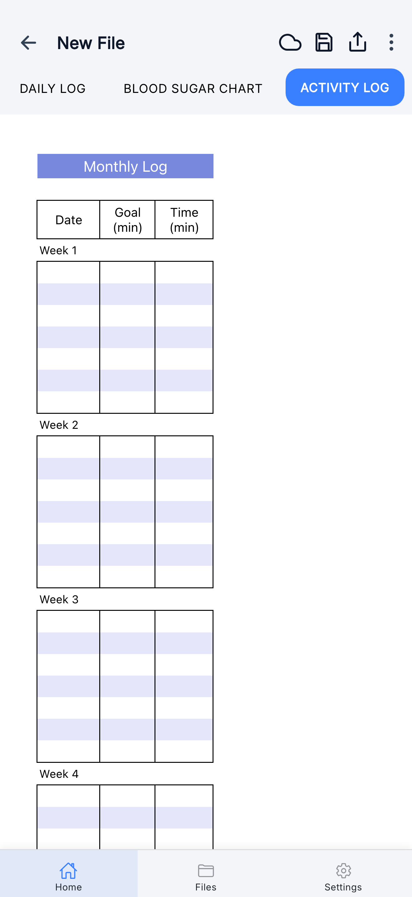 |

| Meal Planner | Guidelines | Edit Modal | Files Page |
|:---:|:---:|:---:|:---:|
| 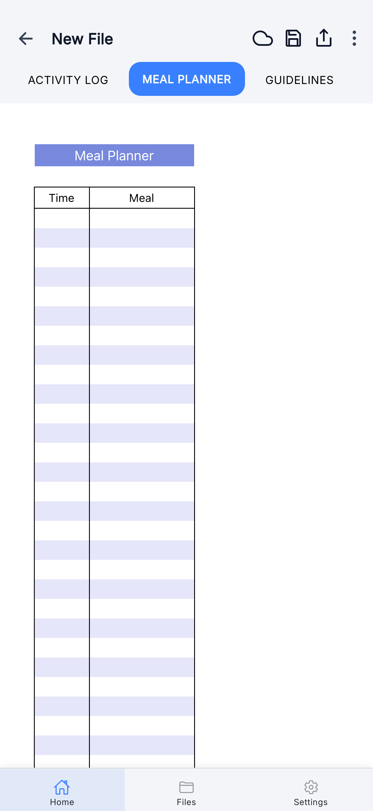 | 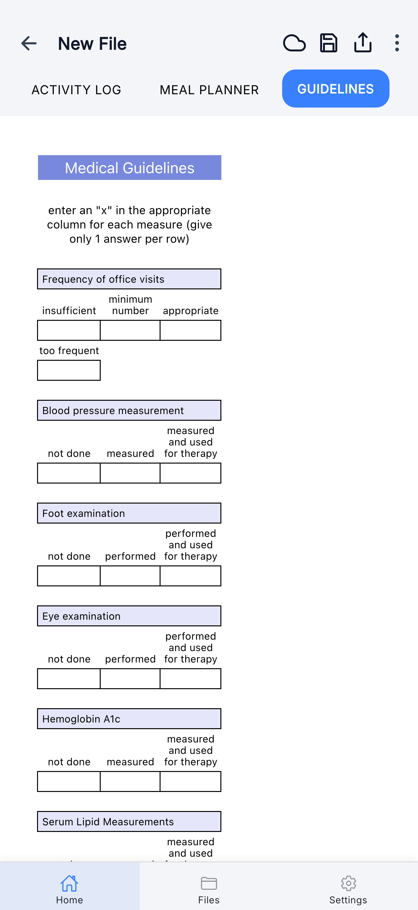 | 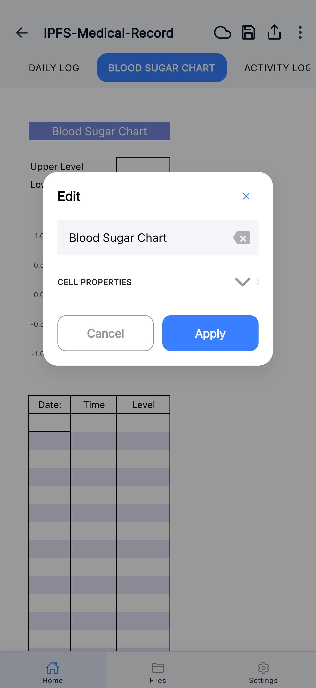 |  |

| IPFS Save Dialog | IPFS Success | Settings |
|:---:|:---:|:---:|
| 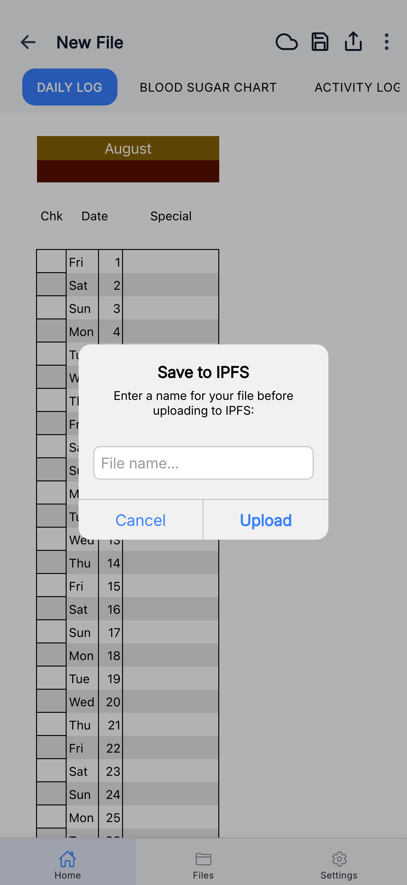 | 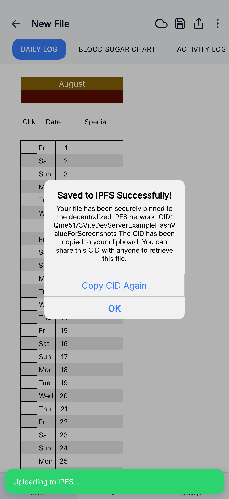 | 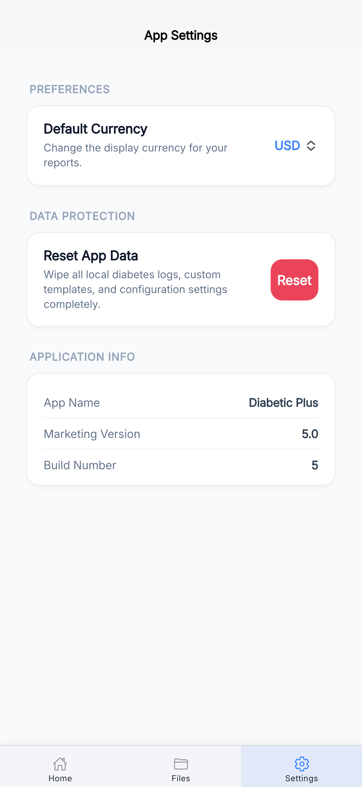 |

---

## 🏗️ Architecture & Automation

This app is built on a metadata-driven architecture. A single application container runs the core SocialCalc engine and offline storage layer. The [scripts](scripts) directory provides three automation pipelines to rebrand, asset-generate, and screenshot-automate app variants from this base.

```
                  +--------------------------------+
                  |  Rebranding Config (data.json) |
                  +---------------+----------------+
                                  |
                                  | (update-app.sh)
                                  v
+---------------------------------+---------------------------------+
|                     AUTOMATED APP REBRANDING                     |
|                                                                   |
|  * Patches 19 files (Bundle ID, app name, variables, menus)      |
|  * Re-generates assets (App Icons, Universal Splash Screens)     |
|  * Captures App Store Screenshots via Playwright emulation        |
+---------------------------------+---------------------------------+
                                  |
                                  v
+---------------------------------+---------------------------------+
|                    CORE TEMPLATE CONTAINER                        |
|                                                                   |
|  +--------------------+   +-------------------+  +-------------+  |
|  | SocialCalc Engine  |   | localStorage Layer|  | IPFS Backup |  |
|  +--------------------+   +-------------------+  +-------------+  |
+-------------------------------------------------------------------+
```

---

## 🛠️ Tech Stack

| Layer | Technology |
|---|---|
| **Core Framework** | [Ionic React](https://ionicframework.com/docs/react) v8.7 (React 19, TypeScript) |
| **Native Bridge** | Capacitor v8 |
| **Spreadsheet Engine** | SocialCalc (touch-optimized) |
| **Storage** | `localStorage` |
| **Charts** | Chart.js + react-chartjs-2 |
| **PDF Export** | html2canvas + jsPDF |
| **IPFS** | Decentralized backup via IPFS gateway |
| **Bundler** | Vite |
| **Automation** | Playwright, Python3, Bash |

---

## 🚀 Development & Setup

### Prerequisites
- Node.js (v18+)
- Ionic CLI (`npm install -g @ionic/cli`)

### Quick Start
1. **Install dependencies**:
   ```bash
   npm install
   ```
2. **Start local development server**:
   ```bash
   npm run dev
   ```
3. **Run unit tests**:
   ```bash
   npm run test.unit
   ```
4. **Build web distribution bundle**:
   ```bash
   npm run build
   ```

### Capacitor Native Integration (Android & iOS)
```bash
# Sync web build to native platform projects
npx cap sync

# Launch on iOS
npx cap run ios

# Launch on Android
npx cap run android
```

---

## 🤖 App Automation & Rebranding Suite

The [scripts](scripts) directory contains three distinct automation pipelines.

### 1. App Configuration & Rebranding (`scripts/app-update-automation`)
Easily update the core identity, bundle IDs, onboarding flows, template files, theme colors, and PDF layouts across **19 files** in one command.

- **Configuration File**: `scripts/app-update-automation/data.json`
- **Automation Script**: `scripts/app-update-automation/update-app.sh`
- **How to execute**:
  ```bash
  bash scripts/app-update-automation/update-app.sh
  ```

### 2. Branding Asset Generation (`scripts/app-assets-generation`)
Automatically scans the workspace for high-resolution PNG templates and exports multi-platform icon and splash screen assets.

- **Generated Assets**:
  - **iOS**: App Store icon (`AppIcon-512@2x.png`) and Launch Screen splash images.
  - **PWA/Web**: Touch icons written to `public/` (`apple-touch-icon-180x180.png`, `pwa-192x192.png`, `pwa-512x512.png`, etc.)
- **How to execute**:
  ```bash
  bash scripts/app-assets-generation/generate_assets.sh
  ```

### 3. App Store Screenshot Automation (`scripts/app-screenshot-automation`)
Automates high-resolution screenshot generation for all major iPhone and iPad viewports using Playwright. Screenshots are saved to `public/screenshot/`.

- **Viewports Covered**:
  - **6.9" Display**: iPhone 16 Pro Max → `public/screenshot/iphone69/`
  - **6.5" Display**: iPhone 14 Plus / 13 Pro Max → `public/screenshot/iphone65/`
  - **6.1" Display**: iPhone 16 / 15 / 14 / 13 / 12 → `public/screenshot/iphone61/`
  - **13" iPad**: iPad Pro 13" → `public/screenshot/ipad13/`
  - **11" iPad**: iPad Pro 11" → `public/screenshot/ipad11/`
- **How to execute**:
  1. Start the local dev server (`npm run dev` at `http://localhost:3000`).
  2. Navigate to the automation directory:
     ```bash
     cd scripts/app-screenshot-automation
     npm install
     npx playwright install
     ```
  3. Run the screen capturer:
     ```bash
     npm run capture
     ```

---

## 🖼️ App Icons & PWA Assets

All icon assets are located in `public/`:

| File | Size | Purpose |
|---|---|---|
| `public/apple-touch-icon-180x180.png` | 180×180 | iOS home screen / PWA touch icon |
| `public/pwa-64x64.png` | 64×64 | PWA favicon |
| `public/pwa-192x192.png` | 192×192 | PWA standard icon |
| `public/pwa-512x512.png` | 512×512 | PWA large icon |
| `public/maskable-icon-512x512.png` | 512×512 | PWA maskable icon |
| `public/favicon.ico` | 48×48 | Browser tab favicon |

---

## 📄 License

[MIT](LICENSE)
